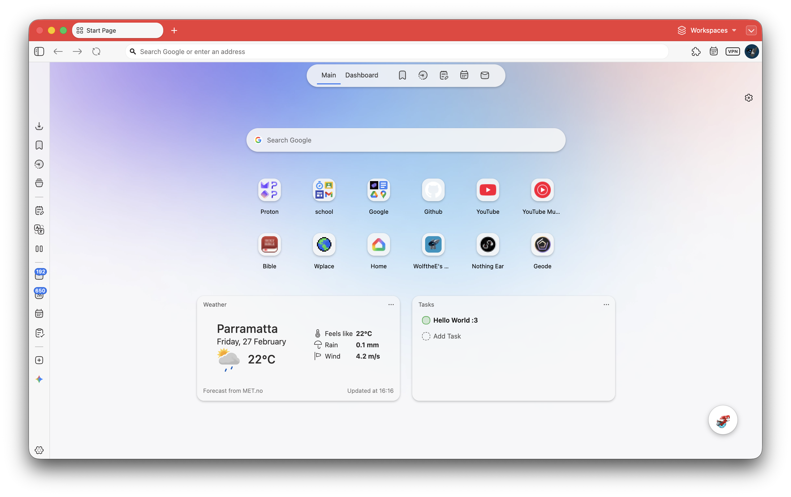

 

<h1 align="center">Wolf Vivaldi</h1>

Make Vivaldi more smoother and less cluttered

 

## Goal of this?
I love Vivaldi but in some areas it makes me question why? Why is this menu bar so ugly or why is the transition so rough? So I made some small but clear changes to make Vivaldi to my liking!

 ## Features
 - Added way more animations and transition for much smoother experiances
 - Added more user feedback when hovering over buttons
 - Removed some unessry borders to make the UI less cluttered
 - Changed some UI backgrounds to better match themes
 - And so much more!

